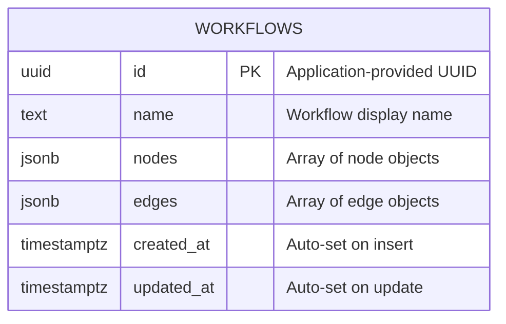

# feat: Implement Weather Workflow Backend

## Overview

Replace the two stubbed Go handlers with a real implementation that persists workflow definitions to PostgreSQL and executes workflows in-memory with real weather API integration. The frontend is complete; we are implementing backend logic only (with one trivial frontend fix).

## Problem Statement / Motivation

The backend currently returns hardcoded JSON from both endpoints. We need:
1. A database-backed workflow store
2. A graph-traversal execution engine that calls the Open-Meteo weather API
3. Step-by-step execution results matching the frontend's expected response shape

## Critical Findings from Spec Analysis

### Finding 1: Frontend status check bug

The `ExecutionResults.tsx` component checks `status === 'completed'` for the green icon (line 52), but the canonical `ExecutionStep` TypeScript type defines `status: 'success' | 'error'`. If we return `"success"`, the frontend shows a red X.

**Decision:** Return `"completed"` as the success step status to match what the frontend renderer actually checks. This is pragmatic -- the frontend's `GenericStep` interface already accommodates this, and it avoids any frontend changes.

### Finding 2: Response format -- hybrid approach

The canonical `ExecutionResults` type has fields like `executionId`, `stepNumber`, `nodeType`, `duration`, `timestamp`. The stub has `executedAt`, `nodeId`, `type`, `label`. The frontend `ExecutionResultsComponent` handles both via `GenericStep`.

**Decision:** Return a response that includes fields from **both** formats:
- Include `executionId`, `status`, `startTime`, `endTime`, `totalDuration` (canonical)
- Each step includes: `stepNumber`, `nodeId`, `nodeType`, `type`, `label`, `status`, `duration`, `timestamp`, `output` (union of both)
- `output.message` is always populated (the frontend displays it)

This maximizes frontend compatibility regardless of which rendering path is taken.

### Finding 3: Nginx proxy path stripping

The nginx config at `web/nginx.conf` line 24 has `proxy_pass http://api:8080/;` (trailing slash strips `/api/` prefix). The Go router mounts at `/api/v1`. This causes 404s in production Docker.

**Decision:** Fix nginx to `proxy_pass http://api:8080;` (no trailing slash). This is a one-character fix, not a "major frontend rewrite."

### Finding 4: Floating-point equals comparison

Direct `==` comparison of floats is unreliable.

**Decision:** Round both temperature and threshold to 1 decimal place before comparison. Document in NOTES.md.

## Proposed Solution

### Architecture

```
api/
  main.go                              # Entry point (add schema init + seed)
  pkg/db/postgres.go                   # Existing -- no changes
  services/workflow/
    service.go                         # Add repository dependency
    workflow.go                        # Replace stub handlers
    models.go                         # Domain types (Workflow, Node, Edge, etc.)
    repository.go                      # DB operations (Get, Upsert)
    executor.go                        # NodeExecutor interface + registry
    executors.go                       # Concrete executor implementations
    weather.go                         # Open-Meteo HTTP client (interface for testability)
    engine.go                          # Graph traversal + execution orchestration
    workflow_test.go                   # Handler tests
    executor_test.go                   # Executor unit tests
    engine_test.go                     # Graph traversal + integration tests
    repository_test.go                 # Repository tests (requires test DB)
```

### ERD



Single table. Nodes and edges stored as JSONB arrays. New node types require zero schema changes.

### Sequence Flow -- Execute Workflow

```
Client                    Handler              Engine              Executors           Open-Meteo
  |                         |                    |                    |                    |
  |-- POST /execute ------->|                    |                    |                    |
  |   {formData,condition}  |                    |                    |                    |
  |                         |-- Load workflow -->|                    |                    |
  |                         |   from DB (by id)  |                    |                    |
  |                         |                    |                    |                    |
  |                         |-- Execute(wf, )--->|                    |                    |
  |                         |   input)           |                    |                    |
  |                         |                    |-- Find start ----->|                    |
  |                         |                    |   node (type=      |                    |
  |                         |                    |   "start")         |                    |
  |                         |                    |                    |                    |
  |                         |                    |   FOR each node:   |                    |
  |                         |                    |-- Lookup executor->|                    |
  |                         |                    |   by node.type     |                    |
  |                         |                    |                    |                    |
  |                         |                    |   [start]          |                    |
  |                         |                    |<-- {message} ------|                    |
  |                         |                    |                    |                    |
  |                         |                    |   [form]           |                    |
  |                         |                    |<-- {formData} -----|                    |
  |                         |                    |                    |                    |
  |                         |                    |   [integration]    |                    |
  |                         |                    |                    |-- GET forecast --->|
  |                         |                    |                    |<-- {temp: 28.5} ---|
  |                         |                    |<-- {temperature} --|                    |
  |                         |                    |                    |                    |
  |                         |                    |   [condition]      |                    |
  |                         |                    |<-- {result:true} --|                    |
  |                         |                    |                    |                    |
  |                         |                    |   Pick edge where  |                    |
  |                         |                    |   sourceHandle =   |                    |
  |                         |                    |   "true" -> email  |                    |
  |                         |                    |                    |                    |
  |                         |                    |   [email]          |                    |
  |                         |                    |<-- {emailDraft} ---|                    |
  |                         |                    |                    |                    |
  |                         |                    |   [end]            |                    |
  |                         |                    |<-- {message} ------|                    |
  |                         |                    |                    |                    |
  |<-- ExecutionResults ----|<-- results --------|                    |                    |
```

### Sequence Flow -- Error Mid-Execution

```
Client                    Handler              Engine              IntegrationExec     Open-Meteo
  |                         |                    |                    |                    |
  |-- POST /execute ------->|                    |                    |                    |
  |                         |-- Execute -------->|                    |                    |
  |                         |                    |   [start] OK       |                    |
  |                         |                    |   [form] OK        |                    |
  |                         |                    |   [integration]    |                    |
  |                         |                    |                    |-- GET forecast --->|
  |                         |                    |                    |<-- TIMEOUT --------|
  |                         |                    |<-- error ----------|                    |
  |                         |                    |                    |                    |
  |                         |                    |   STOP. Return     |                    |
  |                         |                    |   steps 1-3 with   |                    |
  |                         |                    |   step 3 = error   |                    |
  |                         |                    |                    |                    |
  |<-- 200 {status:"failed",|<-- partial --------|                    |                    |
  |    steps:[ok,ok,err]}   |    results         |                    |                    |
```

**Key:** Execution errors return HTTP 200 with `status: "failed"` and partial steps. Only request-level errors (bad input, workflow not found) return 4xx.

## Implementation Phases

### Phase 1: Domain Models + Database

**Files:** `models.go`, `repository.go`

#### `models.go` -- Domain types

```go
// models.go

type Workflow struct {
    ID        string    `json:"id"`
    Name      string    `json:"name"`
    Nodes     []Node    `json:"nodes"`
    Edges     []Edge    `json:"edges"`
    CreatedAt time.Time `json:"createdAt"`
    UpdatedAt time.Time `json:"updatedAt"`
}

type Node struct {
    ID       string         `json:"id"`
    Type     string         `json:"type"`
    Position Position       `json:"position"`
    Data     NodeData       `json:"data"`
}

type Position struct {
    X float64 `json:"x"`
    Y float64 `json:"y"`
}

type NodeData struct {
    Label       string                 `json:"label"`
    Description string                 `json:"description"`
    Metadata    map[string]interface{} `json:"metadata,omitempty"`
}

type Edge struct {
    ID           string            `json:"id"`
    Source       string            `json:"source"`
    Target       string            `json:"target"`
    Label        string            `json:"label,omitempty"`
    Type         string            `json:"type,omitempty"`
    SourceHandle string            `json:"sourceHandle,omitempty"`
    TargetHandle string            `json:"targetHandle,omitempty"`
    Animated     bool              `json:"animated,omitempty"`
    Style        map[string]interface{} `json:"style,omitempty"`
    LabelStyle   map[string]interface{} `json:"labelStyle,omitempty"`
}
```

#### `repository.go` -- Database operations

```go
// repository.go

type Repository struct {
    db *pgxpool.Pool
}

func NewRepository(pool *pgxpool.Pool) *Repository

// InitSchema creates the workflows table if it doesn't exist.
func (r *Repository) InitSchema(ctx context.Context) error
// SQL: CREATE TABLE IF NOT EXISTS workflows (
//   id UUID PRIMARY KEY,
//   name TEXT NOT NULL DEFAULT '',
//   nodes JSONB NOT NULL DEFAULT '[]',
//   edges JSONB NOT NULL DEFAULT '[]',
//   created_at TIMESTAMPTZ NOT NULL DEFAULT NOW(),
//   updated_at TIMESTAMPTZ NOT NULL DEFAULT NOW()
// )

// Seed inserts the sample workflow if it doesn't already exist.
func (r *Repository) Seed(ctx context.Context) error
// SQL: INSERT INTO workflows (id, name, nodes, edges) VALUES ($1, $2, $3, $4)
//      ON CONFLICT (id) DO NOTHING

// Get retrieves a workflow by ID. Returns nil, nil if not found.
func (r *Repository) Get(ctx context.Context, id string) (*Workflow, error)
// SQL: SELECT id, name, nodes, edges, created_at, updated_at
//      FROM workflows WHERE id = $1
```

#### Schema init + seed in `main.go`

After creating the service, call `repo.InitSchema(ctx)` and `repo.Seed(ctx)`.

---

### Phase 2: Execution Engine

**Files:** `executor.go`, `executors.go`, `weather.go`, `engine.go`

#### `executor.go` -- Interface + registry

```go
// executor.go

// ExecutionState holds shared state passed between node executors.
type ExecutionState struct {
    FormData    map[string]interface{} // User input from the form
    Condition   ConditionInput         // Operator + threshold
    Variables   map[string]interface{} // Accumulated outputs (temperature, etc.)
}

type ConditionInput struct {
    Operator  string  `json:"operator"`
    Threshold float64 `json:"threshold"`
}

// StepResult is the output of a single node execution.
type StepResult struct {
    NodeID   string
    NodeType string
    Label    string
    Status   string                 // "completed" or "error"
    Output   map[string]interface{} // Includes "message" and type-specific fields
    Duration time.Duration
    Error    string
}

// NodeExecutor executes a single node type.
type NodeExecutor interface {
    Execute(ctx context.Context, node Node, state *ExecutionState) (*StepResult, error)
}

// Registry maps node type strings to their executor.
type Registry map[string]NodeExecutor

func NewRegistry(weatherClient WeatherClient) Registry {
    return Registry{
        "start":       &StartExecutor{},
        "form":        &FormExecutor{},
        "integration": &IntegrationExecutor{client: weatherClient},
        "condition":   &ConditionExecutor{},
        "email":       &EmailExecutor{},
        "end":         &EndExecutor{},
    }
}
```

#### `weather.go` -- HTTP client interface

```go
// weather.go

// WeatherClient fetches current temperature for coordinates.
type WeatherClient interface {
    GetTemperature(ctx context.Context, lat, lon float64) (float64, error)
}

// OpenMeteoClient calls the Open-Meteo API.
type OpenMeteoClient struct {
    httpClient *http.Client // 10-second timeout
}

func NewOpenMeteoClient() *OpenMeteoClient {
    return &OpenMeteoClient{
        httpClient: &http.Client{Timeout: 10 * time.Second},
    }
}

// GetTemperature calls Open-Meteo and returns current_weather.temperature.
func (c *OpenMeteoClient) GetTemperature(ctx context.Context, lat, lon float64) (float64, error)
// GET https://api.open-meteo.com/v1/forecast?latitude={lat}&longitude={lon}&current_weather=true
// Parse response JSON, extract current_weather.temperature
// Return wrapped error on HTTP failure, timeout, or unexpected response shape
```

#### `executors.go` -- Concrete implementations

Six executors, each implementing `NodeExecutor`:

**StartExecutor** -- No-op, returns success message.

**FormExecutor** -- Reads `state.FormData`, validates non-empty name/email/city, returns formData in output.

**IntegrationExecutor** -- Looks up city coordinates from `node.Data.Metadata["options"]`, calls `WeatherClient.GetTemperature()`, stores result in `state.Variables["temperature"]`. Returns apiResponse in output.

**ConditionExecutor** -- Reads `state.Variables["temperature"]` and `state.Condition`, evaluates comparison. Returns `conditionResult` with expression, result, temperature, operator, threshold. Sets `state.Variables["conditionResult"]` to `"true"` or `"false"` (string, for edge matching).

**EmailExecutor** -- Builds mock email payload from `node.Data.Metadata["emailTemplate"]`, substituting `{{city}}`, `{{temperature}}`, etc. Returns emailDraft in output.

**EndExecutor** -- No-op, returns completion message.

#### `engine.go` -- Graph traversal

```go
// engine.go

type Engine struct {
    registry Registry
}

func NewEngine(registry Registry) *Engine

// Execute traverses the workflow graph and returns execution results.
func (e *Engine) Execute(ctx context.Context, wf *Workflow, input *ExecutionState) (*ExecutionResults, error)
```

**Traversal algorithm:**
1. Find the start node (first node where `type == "start"`). Error if none found.
2. Initialize step counter = 0.
3. Execute current node via registry lookup. Record step result.
4. If step errors, stop. Set overall status = "failed", return partial results.
5. Find outgoing edges from current node:
   - For condition nodes: filter edges by `sourceHandle` matching `state.Variables["conditionResult"]`
   - For other nodes: take the single outgoing edge
6. If no outgoing edge (end node), stop. Set overall status = "completed".
7. Set current node = edge target. Increment step counter.
8. If step counter > 100, stop with error (cycle protection).
9. Goto step 3.

**`ExecutionResults` struct** (returned to handler):

```go
type ExecutionResults struct {
    ExecutionID   string                 `json:"executionId"`
    Status        string                 `json:"status"` // "completed" | "failed"
    StartTime     string                 `json:"startTime"`
    EndTime       string                 `json:"endTime"`
    TotalDuration int64                  `json:"totalDuration"` // milliseconds
    Steps         []ExecutionStep        `json:"steps"`
    Metadata      map[string]interface{} `json:"metadata,omitempty"`
}

type ExecutionStep struct {
    StepNumber int                    `json:"stepNumber"`
    NodeID     string                 `json:"nodeId"`
    NodeType   string                 `json:"nodeType"`
    Type       string                 `json:"type"`      // same as NodeType (frontend compat)
    Label      string                 `json:"label"`
    Status     string                 `json:"status"`    // "completed" | "error"
    Duration   int64                  `json:"duration"`  // milliseconds
    Output     map[string]interface{} `json:"output"`
    Timestamp  string                 `json:"timestamp"`
    Error      string                 `json:"error,omitempty"`
}
```

---

### Phase 3: HTTP Handlers

**Files:** `workflow.go` (replace stubs), `service.go` (add dependencies)

#### Update `service.go`

```go
type Service struct {
    repo   *Repository
    engine *Engine
}

func NewService(pool *pgxpool.Pool) (*Service, error) {
    repo := NewRepository(pool)
    weatherClient := NewOpenMeteoClient()
    registry := NewRegistry(weatherClient)
    engine := NewEngine(registry)
    return &Service{repo: repo, engine: engine}, nil
}
```

#### `HandleGetWorkflow` -- Replace stub

1. Extract `id` from path.
2. Call `repo.Get(ctx, id)`.
3. If not found, return 404 `{"message": "workflow not found"}`.
4. Marshal workflow to JSON, return 200.

#### `HandleExecuteWorkflow` -- Replace stub

1. Extract `id` from path.
2. Parse request body into:
   ```go
   type ExecuteRequest struct {
       FormData  map[string]interface{} `json:"formData"`
       Condition ConditionInput         `json:"condition"`
   }
   ```
3. Validate required fields (name, email, city non-empty; operator is valid enum).
4. Load workflow from `repo.Get(ctx, id)`. If not found, return 404.
5. Build `ExecutionState` from request.
6. Call `engine.Execute(ctx, workflow, state)`.
7. Return 200 with `ExecutionResults` JSON.
8. On engine error (not step error), return 500 `{"message": "..."}`.

#### Error response helper

```go
func writeError(w http.ResponseWriter, status int, message string) {
    w.WriteHeader(status)
    json.NewEncoder(w).Encode(map[string]string{"message": message})
}
```

---

### Phase 4: Infrastructure Fix

**File:** `web/nginx.conf`

Change line 24 from:
```
proxy_pass http://api:8080/;
```
to:
```
proxy_pass http://api:8080;
```

This preserves the `/api/` prefix so the Go router receives the full path.

---

### Phase 5: Tests

#### `executor_test.go` -- Unit tests for each executor

| Test | What it verifies |
|------|-----------------|
| `TestStartExecutor` | Returns completed status, non-empty message |
| `TestFormExecutor_Success` | Captures formData, returns it in output |
| `TestFormExecutor_MissingFields` | Returns error for missing name/email/city |
| `TestIntegrationExecutor_Success` | Calls weather client, stores temperature in state |
| `TestIntegrationExecutor_CityNotFound` | Returns error for unknown city |
| `TestIntegrationExecutor_APIError` | Returns error when weather client fails |
| `TestConditionExecutor_GreaterThan_True` | 28.5 > 25 = true |
| `TestConditionExecutor_GreaterThan_False` | 20.0 > 25 = false |
| `TestConditionExecutor_Equals` | Tests float rounding comparison |
| `TestConditionExecutor_AllOperators` | Table-driven test for all 5 operators |
| `TestEmailExecutor` | Builds mock email with template substitution |
| `TestEndExecutor` | Returns completed status |

Use a `mockWeatherClient` implementing `WeatherClient` for integration executor tests.

#### `engine_test.go` -- Graph traversal tests

| Test | What it verifies |
|------|-----------------|
| `TestEngine_HappyPath_ConditionTrue` | Full traversal: start -> form -> integration -> condition(true) -> email -> end |
| `TestEngine_HappyPath_ConditionFalse` | Traversal: start -> form -> integration -> condition(false) -> end (skips email) |
| `TestEngine_StopsOnError` | Integration fails -> returns 3 steps, status "failed" |
| `TestEngine_NoStartNode` | Returns error for workflow without start node |
| `TestEngine_CycleProtection` | Graph with cycle -> stops at 100 steps |

Use mock weather client and a test workflow built in-code.

#### `repository_test.go` -- Database tests

| Test | What it verifies |
|------|-----------------|
| `TestRepository_InitSchema` | Table is created without error |
| `TestRepository_Seed` | Sample workflow is inserted |
| `TestRepository_Seed_Idempotent` | Second seed call doesn't error or overwrite |
| `TestRepository_Get_Found` | Returns seeded workflow with correct fields |
| `TestRepository_Get_NotFound` | Returns nil, nil for unknown ID |

These require a test database. Use `DATABASE_URL` env var or skip if not available.

#### `workflow_test.go` -- Handler tests

| Test | What it verifies |
|------|-----------------|
| `TestHandleGetWorkflow_Success` | Returns 200 with workflow JSON |
| `TestHandleGetWorkflow_NotFound` | Returns 404 with error message |
| `TestHandleExecuteWorkflow_Success` | Returns 200 with execution results |
| `TestHandleExecuteWorkflow_BadInput` | Returns 400 for missing fields |
| `TestHandleExecuteWorkflow_NotFound` | Returns 404 for unknown workflow |

Use `httptest.NewRecorder` and inject mock repository + engine.

---

### Phase 6: NOTES.md

Write `NOTES.md` at the repo root covering:

1. **Deliverables summary** -- what was implemented
2. **Architecture overview** -- package structure, layering
3. **Key design decisions:**
   - Single JSONB table for extensibility (no migrations for new node types)
   - NodeExecutor interface + registry (open/closed principle)
   - Graph traversal with edge-based branching
   - In-memory execution with no persistence of runs
4. **Trade-offs:**
   - JSONB vs normalized tables
   - Step status `"completed"` vs `"success"` (frontend compat)
   - No execution history persistence
5. **How to add a new node type** -- implement NodeExecutor, register in NewRegistry
6. **Diagrams** -- ERD, sequence flows (from this plan)
7. **Assumptions** documented

## Acceptance Criteria

- [x] `GET /api/v1/workflows/{id}` returns workflow from PostgreSQL
- [x] `GET /api/v1/workflows/{id}` returns 404 for unknown IDs
- [x] `POST /api/v1/workflows/{id}/execute` executes workflow with real weather data
- [x] Condition true path: start -> form -> weather -> condition -> email -> end
- [x] Condition false path: start -> form -> weather -> condition -> end (skip email)
- [x] Weather API timeout/error surfaces as step failure with partial results
- [x] Mock email payload included in output when condition is met
- [x] All 5 operators work: greater_than, less_than, equals, greater_than_or_equal, less_than_or_equal
- [x] Error responses return `{"message": "..."}` for frontend compatibility
- [x] Database schema auto-created on startup
- [x] Sample workflow seeded on first startup
- [x] Unit tests pass for all 6 executor types
- [x] Integration tests pass for engine traversal (both branches)
- [x] Repository tests pass (init, seed, get)
- [x] Handler tests pass (success + error cases)
- [x] `NOTES.md` written with diagrams and design rationale
- [x] Nginx proxy fix applied

## Dependencies & Risks

| Risk | Mitigation |
|------|-----------|
| Open-Meteo API rate limiting | 10-second timeout; note in NOTES.md |
| Float comparison for `equals` | Round to 1 decimal place |
| Graph cycles in DB | Max 100 step traversal limit |
| Frontend status icon mismatch | Use `"completed"` not `"success"` |

## File Change Summary

| File | Action | Description |
|------|--------|-------------|
| `api/services/workflow/models.go` | **Create** | Domain types (Workflow, Node, Edge, ExecutionResults) |
| `api/services/workflow/repository.go` | **Create** | DB operations (InitSchema, Seed, Get) |
| `api/services/workflow/executor.go` | **Create** | NodeExecutor interface, Registry, ExecutionState |
| `api/services/workflow/executors.go` | **Create** | 6 concrete executor implementations |
| `api/services/workflow/weather.go` | **Create** | WeatherClient interface + OpenMeteoClient |
| `api/services/workflow/engine.go` | **Create** | Graph traversal engine |
| `api/services/workflow/workflow.go` | **Modify** | Replace stub handlers with real implementations |
| `api/services/workflow/service.go` | **Modify** | Add Repository + Engine dependencies |
| `api/main.go` | **Modify** | Add schema init + seed on startup |
| `api/services/workflow/executor_test.go` | **Create** | Executor unit tests |
| `api/services/workflow/engine_test.go` | **Create** | Engine integration tests |
| `api/services/workflow/repository_test.go` | **Create** | Repository tests |
| `api/services/workflow/workflow_test.go` | **Create** | Handler tests |
| `web/nginx.conf` | **Modify** | Fix proxy_pass path stripping |
| `NOTES.md` | **Create** | Design rationale + diagrams |

## References

- Brainstorm: `docs/brainstorms/2026-02-16-weather-workflow-backend-brainstorm.md`
- Frontend types: `web/src/types.ts`
- Frontend hooks: `web/src/hooks/useExecuteWorkflow.ts`, `web/src/hooks/useWorkflow.ts`
- Frontend renderer: `web/src/components/ExecutionResults.tsx`
- Current stubs: `api/services/workflow/workflow.go`
- Open-Meteo API: `https://api.open-meteo.com/v1/forecast`
